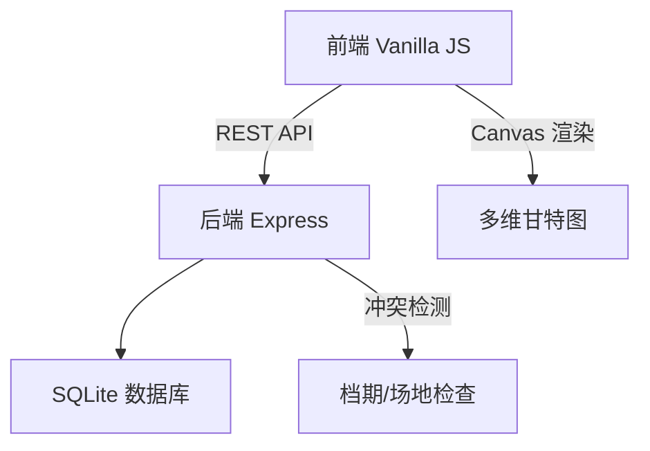
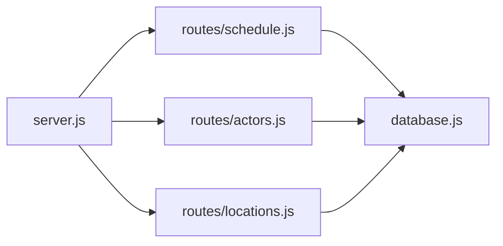
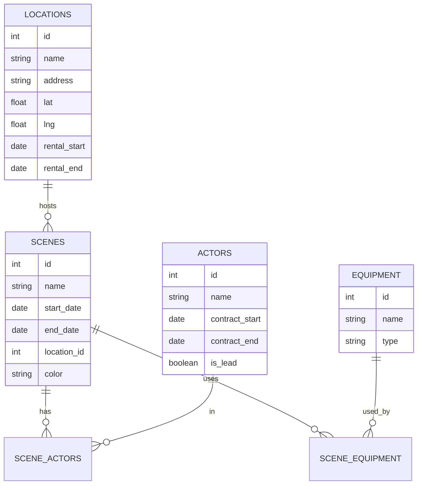

## 1. Architecture Design


## 2. Technology Description
- 前端：Vanilla JavaScript + HTML5 Canvas + CSS3
- 后端：Express.js 4.x
- 数据库：SQLite 3
- 初始化：手动创建项目结构

## 3. 项目结构
```
film-schedule/
├── backend/
│   ├── server.js
│   ├── database.js
│   ├── routes/
│   │   ├── schedule.js
│   │   ├── actors.js
│   │   ├── locations.js
│   │   └── equipment.js
│   └── data/
│       └── film_schedule.db
├── frontend/
│   ├── index.html
│   ├── css/
│   │   └── style.css
│   └── js/
│       ├── gantt.js
│       ├── app.js
│       └── api.js
└── package.json
```

## 4. API Definitions
```typescript
// 场次定义
interface Scene {
  id: number;
  name: string;
  startDate: string;
  endDate: string;
  actors: string[];
  location: string;
  equipment: string[];
  color: string;
}

// 演员定义
interface Actor {
  id: number;
  name: string;
  contractStart: string;
  contractEnd: string;
  isLead: boolean;
}

// 场地定义
interface Location {
  id: number;
  name: string;
  address: string;
  lat: number;
  lng: number;
  rentalStart: string;
  rentalEnd: string;
}

// API 响应
interface Conflict {
  type: 'actor' | 'location' | 'distance';
  description: string;
  sceneIds: number[];
}
```

### API 端点
| 方法 | 路由 | 用途 |
|------|------|------|
| GET | /api/scenes | 获取所有场次 |
| POST | /api/scenes | 创建场次 |
| PUT | /api/scenes/:id | 更新场次 |
| DELETE | /api/scenes/:id | 删除场次 |
| GET | /api/actors | 获取所有演员 |
| GET | /api/locations | 获取所有场地 |
| GET | /api/equipment | 获取所有设备 |
| GET | /api/conflicts | 检测冲突 |

## 5. 服务器架构


## 6. 数据模型

### 6.1 ER 图


### 6.2 DDL 语句
```sql
CREATE TABLE scenes (
    id INTEGER PRIMARY KEY AUTOINCREMENT,
    name TEXT NOT NULL,
    start_date TEXT NOT NULL,
    end_date TEXT NOT NULL,
    location_id INTEGER,
    color TEXT NOT NULL
);

CREATE TABLE actors (
    id INTEGER PRIMARY KEY AUTOINCREMENT,
    name TEXT NOT NULL,
    contract_start TEXT NOT NULL,
    contract_end TEXT NOT NULL,
    is_lead INTEGER DEFAULT 0
);

CREATE TABLE locations (
    id INTEGER PRIMARY KEY AUTOINCREMENT,
    name TEXT NOT NULL,
    address TEXT,
    lat REAL,
    lng REAL,
    rental_start TEXT,
    rental_end TEXT
);

CREATE TABLE equipment (
    id INTEGER PRIMARY KEY AUTOINCREMENT,
    name TEXT NOT NULL,
    type TEXT
);

CREATE TABLE scene_actors (
    scene_id INTEGER,
    actor_id INTEGER,
    PRIMARY KEY (scene_id, actor_id)
);

CREATE TABLE scene_equipment (
    scene_id INTEGER,
    equipment_id INTEGER,
    PRIMARY KEY (scene_id, equipment_id)
);
```
