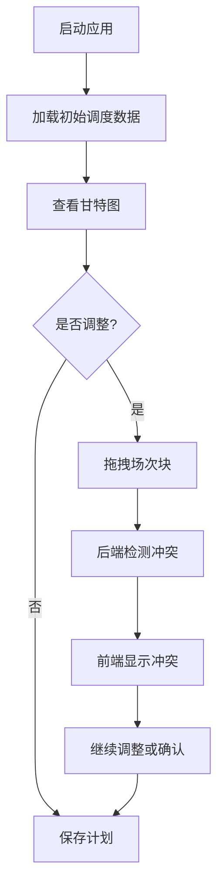

## 1. Product Overview
制片主任排兵布阵图是一个用于影视制作调度的多维甘特图应用，帮助管理演员、场地、设备的档期安排，自动检测并可视化冲突。
- 目标用户：制片主任、副导演、调度经理
- 核心价值：高效统筹拍摄计划，避免档期冲突，优化转场安排

## 2. Core Features

### 2.1 User Roles
| Role | Registration Method | Core Permissions |
|------|---------------------|------------------|
| 制片主任 | 直接使用 | 完整的调度、编辑、查看权限 |

### 2.2 Feature Module
1. **多维甘特图页面**：可视化调度界面、场次拖拽、冲突显示
2. **数据管理模块**：演员合同、场地租赁、设备配置
3. **冲突检测模块**：档期冲突、场地距离检查

### 2.3 Page Details
| Page Name | Module Name | Feature description |
|-----------|-------------|---------------------|
| 甘特图主页面 | 多维时间轴 | 横轴日期，纵轴演员/场地/设备，彩色场次块 |
| 甘特图主页面 | 拖拽交互 | 场次块可拖拽调整时间 |
| 甘特图主页面 | 冲突可视化 | 红色闪电图标标记冲突区域 |
| 甘特图主页面 | 转场缓冲 | 灰色间隔带显示车程时间 |

## 3. Core Process
制片主任启动应用后，查看当前调度状态，通过拖拽场次块调整计划，系统实时检测并标记冲突，最终形成完美统筹的拍摄计划。

## 4. User Interface Design

### 4.1 Design Style
- 主色调：专业深蓝 (#1e3a5f)、工业灰 (#2d3748)
- 强调色：冲突红 (#e53e3e)、安全绿 (#38a169)、转场灰 (#718096)
- 按钮风格：简洁矩形，轻微阴影，悬停上浮
- 字体：JetBrains Mono（时间轴）、Inter（正文）
- 布局风格：左侧导航 + 主画布区域
- 图标风格：简洁线条 + 高对比度

### 4.2 Page Design Overview
| Page Name | Module Name | UI Elements |
|-----------|-------------|-------------|
| 甘特图主页面 | 时间轴区域 | 深色背景，网格线，日期刻度 |
| 甘特图主页面 | 场次块 | 彩色圆角矩形，半透明，可拖拽 |
| 甘特图主页面 | 冲突标记 | 巨大红色闪电图标，闪烁动画 |
| 甘特图主页面 | 转场缓冲 | 灰色条纹区域，文字标注 |

### 4.3 Responsiveness
- 桌面端优先，支持缩放
- 触摸优化：场次块有足够的点击区域

### 4.4 交互效果
- 拖拽时有半透明跟随效果
- 冲突检测时红色闪电闪烁
- 场次块悬停时显示详情
