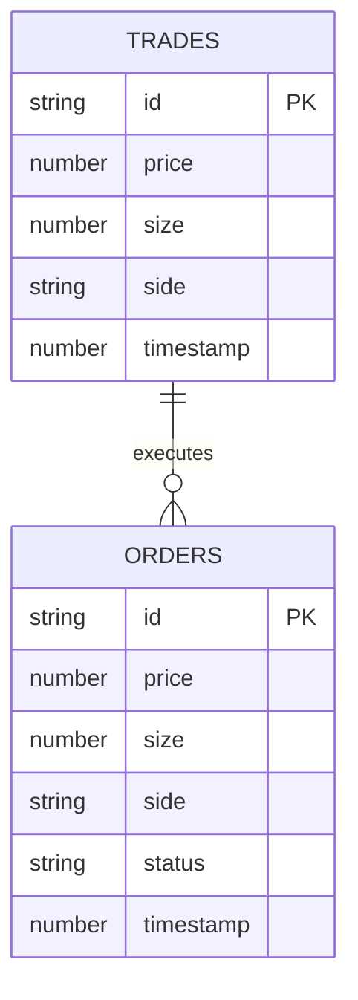

## 1. Architecture Design

```mermaid
graph TD
    subgraph Frontend
        A[React App]
        B[3D Depth Chart Component]
        C[WebSocket Client]
        D[Control Panel]
        E[Data Display]
        A --&gt; B
        A --&gt; C
        A --&gt; D
        A --&gt; E
    end
    
    subgraph Backend
        F[Express Server]
        G[WebSocket Server]
        H[Matching Engine]
        I[Database Layer]
        F --&gt; G
        F --&gt; H
        H --&gt; I
    end
    
    subgraph Database
        J[(better-sqlite3)]
        K[Trades Table]
        L[Orders Table]
        J --&gt; K
        J --&gt; L
    end
    
    C &lt;--&gt; G
    I --&gt; J
```

## 2. Technology Description

- **Frontend**: React@18 + Vite + Three.js + tailwindcss@3 + zustand
- **Backend**: Express@4 + ws (WebSocket library) + better-sqlite3
- **Database**: better-sqlite3 (嵌入式SQLite数据库)
- **3D Rendering**: Three.js
- **Initialization Tool**: vite-init

## 3. Route Definitions

| Route | Purpose |
|-------|---------|
| / | 前端静态页面服务 |
| /ws | WebSocket连接端点 |
| /health | 健康检查接口 |

## 4. API Definitions

### WebSocket消息类型

```typescript
// 订单数据类型
interface Order {
  id: string;
  price: number;
  size: number;
  side: 'bid' | 'ask';
  timestamp: number;
}

// 成交数据类型
interface Trade {
  id: string;
  price: number;
  size: number;
  side: 'buy' | 'sell';
  timestamp: number;
}

// 盘口快照类型
interface OrderBookSnapshot {
  bids: [number, number][]; // [price, size]
  asks: [number, number][];
  sequence: number;
  timestamp: number;
}

// WebSocket消息类型
type WSMessage = 
  | { type: 'snapshot'; data: OrderBookSnapshot }
  | { type: 'update'; data: OrderBookSnapshot }
  | { type: 'trade'; data: Trade }
  | { type: 'scene'; data: SceneType };

// 场景类型
type SceneType = 
  | 'normal'
  | 'battle'        // 多空绞杀
  | 'drought'       // 流动性枯竭
  | 'pump'          // 暴力拉升
  | 'flashcrash';   // 乌龙指
```

## 5. Server Architecture Diagram

```mermaid
graph TB
    subgraph Express Server
        A[HTTP Server]
        B[WebSocket Server]
    end
    
    subgraph Services
        C[OrderBook Service]
        D[Data Generator]
        E[Scene Controller]
    end
    
    subgraph Database
        F[(SQLite DB)]
    end
    
    A --&gt; B
    B --&gt; C
    C --&gt; D
    D --&gt; E
    E --&gt; C
    C --&gt; F
```

## 6. Data Model

### 6.1 Data Model Definition



### 6.2 Data Definition Language

```sql
-- 创建成交记录表
CREATE TABLE IF NOT EXISTS trades (
  id TEXT PRIMARY KEY,
  price REAL NOT NULL,
  size REAL NOT NULL,
  side TEXT NOT NULL CHECK(side IN ('buy', 'sell')),
  timestamp INTEGER NOT NULL
);

-- 创建订单表
CREATE TABLE IF NOT EXISTS orders (
  id TEXT PRIMARY KEY,
  price REAL NOT NULL,
  size REAL NOT NULL,
  side TEXT NOT NULL CHECK(side IN ('bid', 'ask')),
  status TEXT NOT NULL CHECK(status IN ('active', 'filled', 'cancelled')),
  timestamp INTEGER NOT NULL
);

-- 创建索引
CREATE INDEX IF NOT EXISTS idx_trades_timestamp ON trades(timestamp DESC);
CREATE INDEX IF NOT EXISTS idx_orders_side_price ON orders(side, price);
```
