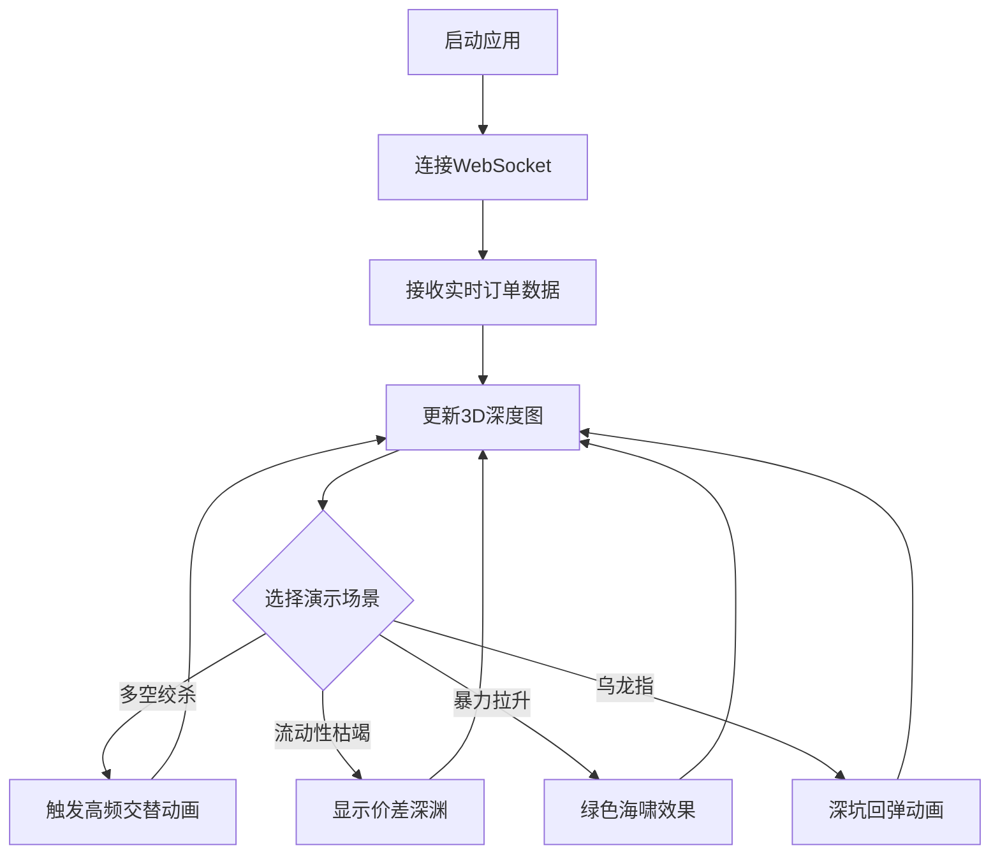

## 1. Product Overview

3D 盘口深度图工具，还原真实交易所微观结构，通过立体可视化展示买卖单分布及市场波动动画效果。

- 目标用户：量化交易员、金融分析师、对市场微观结构感兴趣的投资者
- 产品价值：通过直观的3D可视化和动态场景演示，帮助用户理解市场流动性分布、价格发现过程及极端行情的演变

## 2. Core Features

### 2.1 Feature Module

1. **主界面**：3D 深度图展示、控制面板、实时数据显示
2. **场景演示模块**：预设4种典型市场场景的动画效果
3. **实时数据模块**：WebSocket 连接接收后端推送的逐笔成交和挂单数据

### 2.3 Page Details

| Page Name | Module Name | Feature description |
|-----------|-------------|---------------------|
| 主界面 | 3D 深度图 | 绿色买单山峰、红色卖单悬崖，动态起伏动画 |
| 主界面 | 控制面板 | 场景切换按钮、播放/暂停控制、速度调节 |
| 主界面 | 实时信息 | 最新成交价、买卖价差、成交量显示 |

## 3. Core Process

## 4. User Interface Design

### 4.1 Design Style
- **主色调**：
  - 买单：绿色系（#10b981, #059669）
  - 卖单：红色系（#ef4444, #dc2626）
  - 成交火花：金色（#fbbf24）
  - 背景：深色科技风（#0f172a）
- **视觉风格**：赛博朋克金融风，高对比度，低饱和度背景
- **字体**：使用等宽字体增强金融数据感，标题使用粗体加重
- **布局**：全屏沉浸式3D场景，底部悬浮控制面板
- **图标**：简洁线条风格，金融主题图标

### 4.2 Page Design Overview

| Page Name | Module Name | UI Elements |
|-----------|-------------|-------------|
| 主界面 | 3D 深度图 | Three.js WebGL 渲染，透视相机，动态光照 |
| 主界面 | 控制面板 | 圆角卡片，玻璃拟态效果，悬停发光 |
| 主界面 | 实时信息 | 半透明数据面板，微动画更新 |

### 4.3 Responsiveness
- 桌面优先设计
- 3D 场景自适应窗口大小
- 控制面板在小屏幕上可折叠

### 4.4 3D Scene Guidance
- **环境**：深色渐变背景，模拟交易大厅氛围
- **光照**：
  - 顶部主光源（白色，模拟天花板照明）
  - 侧面补光（绿色和红色，对应买卖单）
  - 成交火花动态闪烁照明
- **相机设置**：45度俯视视角，可旋转缩放
- **动画**：
  - 买单/卖单柱体弹性形变动画
  - 成交粒子爆炸效果
  - 场景切换时的平滑过渡
  - 低频震动效果增加紧迫感
- **性能优化**：使用实例化渲染，限制粒子数量
