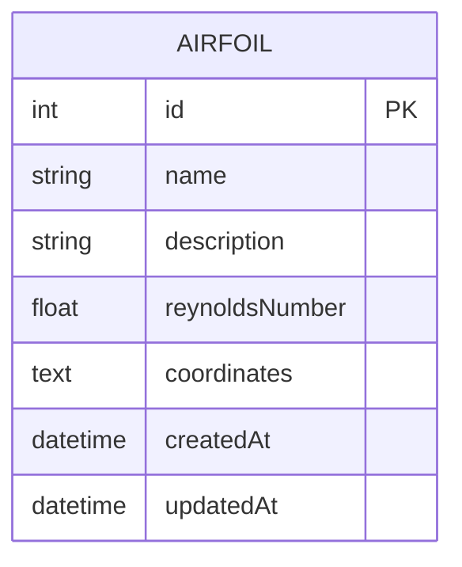

## 1. Architecture Design
```mermaid
graph TD
  Frontend[React + Three.js + TypeScript]
  Backend[Express + TypeScript]
  Database[SQLite]
  
  Frontend --&gt;|HTTP API| Backend
  Backend --&gt;|SQL Queries| Database
```

## 2. Technology Description
- **Frontend**: React@18 + TypeScript + Vite + Three.js + @react-three/fiber + @react-three/drei + Tailwind CSS + Zustand
- **Backend**: Express@4 + TypeScript + SQLite3
- **Database**: SQLite (file-based)
- **Initialization Tool**: vite-init

## 3. Route Definitions
| Route | Purpose |
|-------|---------|
| / | 3D场景主页面 |
| /airfoils | 翼型管理页面 |

## 4. API Definitions

### 4.1 TypeScript Types
```typescript
// 翼型数据类型
interface Airfoil {
  id: number;
  name: string;
  description: string;
  reynoldsNumber: number;
  coordinates: { x: number; y: number }[];
  createdAt: string;
  updatedAt: string;
}

// 粒子配置类型
interface ParticleConfig {
  count: number;
  speed: number;
  windAngle: number;
  turbulence: number;
}
```

### 4.2 API Endpoints

#### GET /api/airfoils
获取所有翼型数据
```typescript
// Response
{
  success: boolean;
  data: Airfoil[];
}
```

#### GET /api/airfoils/:id
获取单个翼型
```typescript
// Response
{
  success: boolean;
  data: Airfoil;
}
```

#### POST /api/airfoils
创建翼型
```typescript
// Request
{
  name: string;
  description: string;
  reynoldsNumber: number;
  coordinates: { x: number; y: number }[];
}

// Response
{
  success: boolean;
  data: Airfoil;
}
```

#### PUT /api/airfoils/:id
更新翼型
```typescript
// Request
{
  name: string;
  description: string;
  reynoldsNumber: number;
  coordinates: { x: number; y: number }[];
}

// Response
{
  success: boolean;
  data: Airfoil;
}
```

#### DELETE /api/airfoils/:id
删除翼型
```typescript
// Response
{
  success: boolean;
}
```

## 5. Server Architecture Diagram
```mermaid
graph TD
  Controller[Controllers &lt;br/&gt; AirfoilController]
  Service[Services &lt;br/&gt; AirfoilService]
  Repository[Repositories &lt;br/&gt; AirfoilRepository]
  DB[SQLite Database]
  
  Controller --&gt; Service
  Service --&gt; Repository
  Repository --&gt; DB
```

## 6. Data Model

### 6.1 Data Model Definition


### 6.2 Data Definition Language
```sql
CREATE TABLE IF NOT EXISTS airfoils (
  id INTEGER PRIMARY KEY AUTOINCREMENT,
  name TEXT NOT NULL,
  description TEXT,
  reynoldsNumber REAL NOT NULL,
  coordinates TEXT NOT NULL,
  createdAt DATETIME DEFAULT CURRENT_TIMESTAMP,
  updatedAt DATETIME DEFAULT CURRENT_TIMESTAMP
);

INSERT INTO airfoils (name, description, reynoldsNumber, coordinates) VALUES
('NACA 0012', '对称翼型，基础研究用', 500000, '[{"x":0,"y":0},{"x":1,"y":0}]'),
('Clark Y', '经典通用翼型', 300000, '[{"x":0,"y":0},{"x":1,"y":0}]');
```
