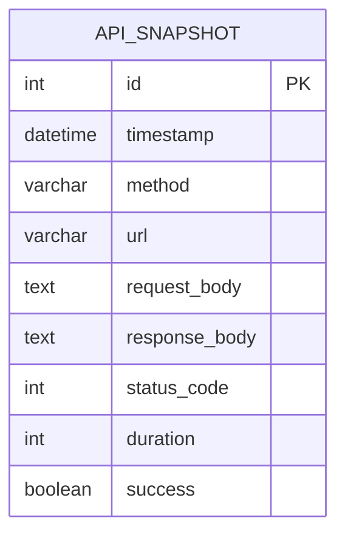

## 1. Architecture Design
```mermaid
graph TB
    subgraph Frontend
        A[Vanilla JS]
        B[Canvas Animation]
        C[UI Controls]
    end
    
    subgraph Backend
        D[Express Server]
        E[API Interceptor]
        F[SQLite DB]
    end
    
    A &lt;--&gt; D
    E --&gt; F
```

## 2. Technology Description
- **前端**: Vanilla JavaScript (原生JS) + HTML5 Canvas
- **后端**: Express.js 4.x
- **数据库**: SQLite (better-sqlite3)
- **初始化**: 手动搭建项目结构

## 3. Route Definitions
| Route | Purpose |
|-------|---------|
| / | 主页面 |
| /api/* | 拦截所有API请求 |
| /api/history | 获取历史记录 |
| /api/replay | 触发回放 |
| /api/scene/:id | 设置场景 |

## 4. API Definitions

### 4.1 类型定义
```typescript
interface ApiSnapshot {
  id: number;
  timestamp: string;
  method: string;
  url: string;
  requestBody: any;
  responseBody: any;
  statusCode: number;
  duration: number;
  success: boolean;
}

interface SceneConfig {
  id: string;
  name: string;
  description: string;
  requestRate: number;
  errorRate: number;
  timeoutRate: number;
  color: string;
}
```

### 4.2 API 端点

#### GET /api/history
获取历史记录
- **Response**: `ApiSnapshot[]`

#### POST /api/replay
触发历史回放
- **Request**: `{ snapshotIds?: number[] }`
- **Response**: `{ success: boolean, count: number }`

#### POST /api/scene/:id
设置当前场景
- **Response**: `{ success: boolean, scene: SceneConfig }`

## 5. Server Architecture Diagram
```mermaid
graph LR
    A[Client Request] --&gt; B[Express Middleware]
    B --&gt; C[Interceptor]
    C --&gt; D[Route Handler]
    C --&gt; E[SQLite Storage]
    D --&gt; F[Response]
```

## 6. Data Model

### 6.1 Data Model Definition


### 6.2 DDL Statements
```sql
CREATE TABLE IF NOT EXISTS api_snapshots (
  id INTEGER PRIMARY KEY AUTOINCREMENT,
  timestamp DATETIME DEFAULT CURRENT_TIMESTAMP,
  method TEXT NOT NULL,
  url TEXT NOT NULL,
  request_body TEXT,
  response_body TEXT,
  status_code INTEGER,
  duration INTEGER,
  success BOOLEAN DEFAULT 1
);

CREATE INDEX IF NOT EXISTS idx_timestamp ON api_snapshots(timestamp);
CREATE INDEX IF NOT EXISTS idx_success ON api_snapshots(success);
```

### 6.3 初始场景数据
```javascript
const SCENES = [
  {
    id: 'double-11',
    name: '双十一大促',
    description: '满载高压状态',
    requestRate: 200,
    errorRate: 0.02,
    timeoutRate: 0.05,
    color: '#ff3366'
  },
  {
    id: 'db-down',
    name: '数据库宕机',
    description: '全线超时拥堵',
    requestRate: 50,
    errorRate: 0.8,
    timeoutRate: 0.9,
    color: '#ffcc00'
  },
  {
    id: 'incompatible',
    name: '接口不兼容',
    description: '连环断裂',
    requestRate: 100,
    errorRate: 0.4,
    timeoutRate: 0.1,
    color: '#ff6600'
  },
  {
    id: 'normal',
    name: '日常平稳',
    description: '丝滑绿色流光',
    requestRate: 30,
    errorRate: 0,
    timeoutRate: 0,
    color: '#00ff88'
  }
];
```

## 7. 文件结构
```
project-root/
├── public/
│   ├── index.html
│   ├── css/
│   │   └── style.css
│   └── js/
│       ├── app.js
│       ├── animation.js
│       └── controls.js
├── api/
│   ├── server.js
│   ├── db.js
│   └── interceptor.js
├── package.json
└── README.md
```
