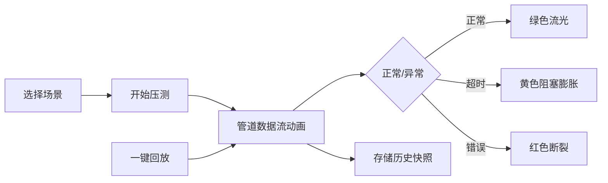

## 1. Product Overview
微服务契约测试与回放引擎 - 面向测试工程师的接口压测工具，通过立体管道传输动画可视化API请求/响应流量，并支持历史快照存储与一键回放功能。

### 目标与价值
- 可视化API流量传输过程，提供直观的性能监控体验
- 记录所有API调用作为历史快照，便于问题追溯
- 支持多种场景模拟，帮助测试工程师快速定位系统瓶颈

## 2. Core Features

### 2.1 User Roles
| Role | Registration Method | Core Permissions |
|------|---------------------|------------------|
| 测试工程师 | 无需登录 | 使用所有压测功能、查看回放场景 |

### 2.2 Feature Module
1. **主页面**：3D管道传输动画可视化、控制面板
2. **场景预设**：四个快捷加载场景，快速切换不同压测模式

### 2.3 Page Details
| Page Name | Module Name | Feature description |
|-----------|-------------|---------------------|
| 主页面 | 3D管道动画 | 左侧请求源 → 中间立体管道 → 右侧响应池的可视化数据流 |
| 主页面 | 控制面板 | 开始/停止压测、一键回放、历史记录查看 |
| 主页面 | 场景预设 | 四个预定义场景按钮：双十一大促、数据库宕机、接口不兼容、日常平稳 |

## 3. Core Process

### 主要流程
1. 用户选择场景预设或自定义配置
2. 点击"开始压测"启动数据流
3. 数据包像水流一样从左侧流向右侧
4. 遇到响应超时或错误时，管道变色并产生阻塞效果
5. 所有API调用被记录到SQLite数据库
6. 点击"一键回放"重现历史流量

## 4. User Interface Design

### 4.1 Design Style
- **主色调**：深色科技感背景(#0a0a0f)，配以蓝色(#00d4ff)、绿色(#00ff88)、黄色(#ffcc00)、红色(#ff3366)
- **按钮风格**：圆角矩形，带霓虹发光效果，悬停时有脉冲动画
- **字体**：Fira Code(代码风格) + Inter(可读性)
- **布局风格**：全屏沉浸式设计，主视觉区在上，控制面板在下
- **视觉元素**：粒子效果、光晕、渐变、玻璃拟态UI

### 4.2 Page Design Overview
| Page Name | Module Name | UI Elements |
|-----------|-------------|-------------|
| 主页面 | 管道动画区 | 3D透视管道、流动粒子、响应池、请求源 |
| 主页面 | 场景预设区 | 四个并排按钮，带图标和说明文字 |
| 主页面 | 控制面板 | 大按钮开始/回放、状态指示器、实时统计 |

### 4.3 Responsiveness
- 桌面端优先，响应式适配
- 移动端简化显示，保持核心功能可用

### 4.4 Animation & Visual Effects
- 管道流动：使用Canvas绘制粒子流，模拟水管传输效果
- 阻塞效果：管道膨胀动画 + 粒子堆积
- 场景切换：平滑过渡动画，颜色渐变
- 背景：动态网格，营造科技感空间
