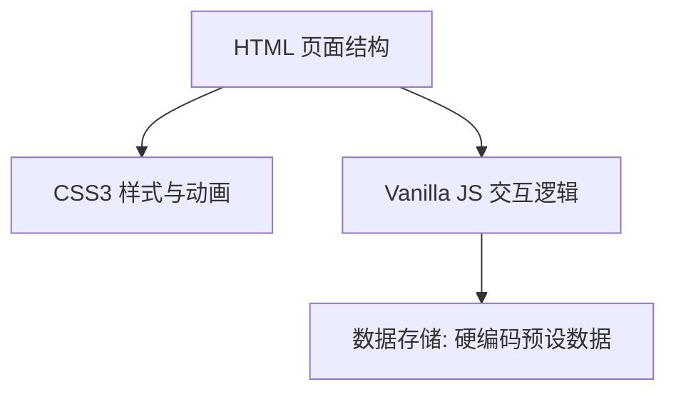
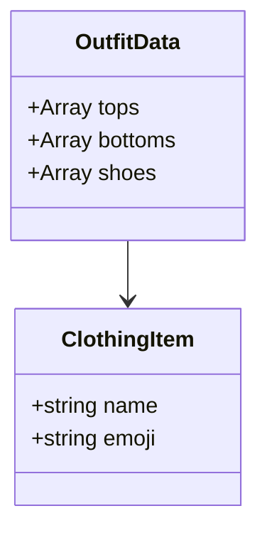

## 1. Architecture Design
纯前端应用，使用原生 HTML、CSS3 和 JavaScript 实现。不需要后端服务，所有数据和逻辑都在浏览器端运行。



## 2. Technology Description
- **前端**: 纯 HTML5 + CSS3 + Vanilla JavaScript（原生 JS）
- **无需构建工具**: 直接在浏览器运行
- **无需后端**: 所有逻辑在前端实现
- **数据**: 使用 JavaScript 数组硬编码预设数据
- **动画**: CSS3 Animations 和 Transitions

## 3. Route Definitions
单页面应用，没有路由。

| Route | Purpose |
|-------|---------|
| / | 唯一页面，展示所有功能 |

## 4. API Definitions
不需要后端 API。

## 5. Server Architecture Diagram
不需要服务器架构。

## 6. Data Model

### 6.1 Data Model Definition
简单的 JavaScript 数组存储衣物数据。



### 6.2 Data Definition Language
使用 JavaScript 数组定义初始数据：

```javascript
const data = {
  tops: [
    { name: "白T恤", emoji: "👕" },
    { name: "卫衣", emoji: "🧥" },
    { name: "衬衫", emoji: "👔" },
    { name: "毛衣", emoji: "🧶" },
    { name: "夹克", emoji: "🧥" }
  ],
  bottoms: [
    { name: "牛仔裤", emoji: "👖" },
    { name: "运动裤", emoji: "🏃" },
    { name: "休闲裤", emoji: "👖" }
  ],
  shoes: [
    { name: "运动鞋", emoji: "👟" },
    { name: "板鞋", emoji: "👞" }
  ]
};
```
