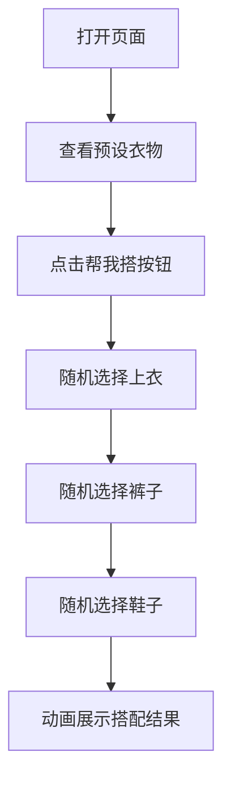

## 1. Product Overview
穿搭随机组合器 - 一个简单有趣的工具，帮助用户快速决定今天穿什么。用户可以预设上衣、裤子、鞋子，点击按钮就能随机生成一套搭配组合。
- 目标用户：每天早上不知道穿什么的人，想要快速做出决定
- 产品价值：节省穿搭决策时间，增加穿搭趣味性

## 2. Core Features

### 2.1 User Roles
不需要用户注册或登录，任何人都可以直接使用。

### 2.2 Feature Module
1. **首页**: 预设展示区域、随机搭配按钮、搭配结果展示

### 2.3 Page Details
| Page Name | Module Name | Feature description |
|-----------|-------------|---------------------|
| 首页 | 预设展示 | 显示预设的5件上衣、3条裤子、2双鞋 |
| 首页 | 随机搭配按钮 | 点击按钮触发随机组合逻辑 |
| 首页 | 搭配结果展示 | 动画展示随机生成的一套完整搭配 |

## 3. Core Process
用户打开页面 → 查看预设衣物 → 点击"帮我搭"按钮 → 系统随机选择上衣、裤子、鞋子各一件 → 以动画效果展示搭配结果

## 4. User Interface Design
### 4.1 Design Style
- **主色调**: 温暖的橙色 (#FF9F43) 和舒适的米色 (#F8F5F2)
- **辅助色**: 柔和的蓝色 (#54A0FF) 和粉色 (#FF6B9D)
- **按钮风格**: 圆角胶囊按钮，带有悬停和点击动画
- **字体**: 圆润的无衬线字体，使用 Google Fonts 的 Poppins
- **布局风格**: 卡片式布局，居中对齐，大量留白
- **图标/emoji**: 使用 Emoji 代替图片，简单可爱

### 4.2 Page Design Overview
| Page Name | Module Name | UI Elements |
|-----------|-------------|-------------|
| 首页 | 顶部标题 | 大号圆润字体，渐变色，居中对齐 |
| 首页 | 预设展示区 | 三个水平排列的卡片，分别展示上衣、裤子、鞋子列表 |
| 首页 | 随机搭配按钮 | 大号胶囊按钮，位于页面中央，悬停有缩放和颜色变化动画 |
| 首页 | 搭配结果展示 | 三个垂直排列的大卡片，带入场动画，显示最终搭配 |

### 4.3 Responsiveness
- 桌面端为主设计，同时适配平板和手机屏幕
- 在小屏幕上，预设展示区改为垂直排列
- 按钮和文字大小自适应屏幕尺寸
- 触摸设备优化，增大点击区域

### 4.4 3D Scene Guidance
不需要 3D 场景。
