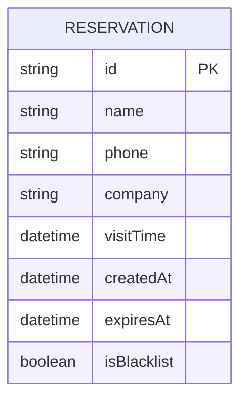

## 1. 架构设计
```mermaid
graph TB
    subgraph "前端"
        A[预约表单页面]
        B[保安核验台]
    end
    
    subgraph "后端"
        C[Express API Server]
        D[业务逻辑层]
        E[数据访问层]
    end
    
    subgraph "数据存储"
        F[(SQLite Database)]
    end
    
    A --&gt;|POST /api/reservation| C
    B --&gt;|POST /api/verify| C
    C --&gt; D
    D --&gt; E
    E --&gt; F
```

## 2. 技术描述
- **前端**：Vanilla JavaScript + HTML5 + CSS3（无框架）
- **后端**：Express@4 + Node.js
- **数据库**：SQLite3
- **二维码**：qrcode.js（前端生成）
- **扫码**：html5-qrcode（核验台扫码）
- **音效**：Web Audio API
- **初始工具**：手动搭建项目结构

## 3. 目录结构
```
.
├── .trae/
│   └── documents/
├── public/
│   ├── index.html          # 预约表单
│   ├── verify.html         # 保安核验台
│   ├── css/
│   │   ├── index.css
│   │   └── verify.css
│   └── js/
│       ├── index.js
│       └── verify.js
├── server/
│   ├── app.js              # Express入口
│   ├── routes/
│   │   ├── reservation.js  # 预约路由
│   │   └── verify.js       # 核验路由
│   ├── db/
│   │   └── database.js     # SQLite数据库
│   └── utils/
│       └── qrcode.js       # 二维码工具
├── package.json
└── README.md
```

## 4. 路由定义
| 路由 | 方法 | 用途 |
|-------|------|---------|
| / | GET | 预约表单页面 |
| /verify | GET | 保安核验台页面 |
| /api/reservation | POST | 创建预约 |
| /api/verify | POST | 核验二维码 |

## 5. API 定义

### 5.1 创建预约
**请求**
```typescript
POST /api/reservation
{
  name: string;
  phone: string;
  company: string;
  visitTime: string; // ISO 8601
  duration: number; // 分钟
}
```

**响应**
```typescript
{
  success: boolean;
  data: {
    id: string;
    qrCode: string; // 二维码内容（含时间戳）
    expiresAt: string;
  };
}
```

### 5.2 核验预约
**请求**
```typescript
POST /api/verify
{
  qrCode: string;
}
```

**响应**
```typescript
{
  success: boolean;
  status: 'success' | 'expired' | 'blacklist' | 'error';
  message: string;
  data?: {
    name: string;
    company: string;
    expiresAt: string;
  };
}
```

## 6. 数据模型

### 6.1 数据模型定义


### 6.2 数据库初始化SQL
```sql
CREATE TABLE IF NOT EXISTS reservations (
  id TEXT PRIMARY KEY,
  name TEXT NOT NULL,
  phone TEXT NOT NULL,
  company TEXT NOT NULL,
  visitTime TEXT NOT NULL,
  createdAt TEXT NOT NULL,
  expiresAt TEXT NOT NULL,
  isBlacklist INTEGER DEFAULT 0
);
```

### 6.3 测试数据
```sql
-- 正常预约
INSERT INTO reservations (id, name, phone, company, visitTime, createdAt, expiresAt, isBlacklist)
VALUES ('test1', '张三', '13800138000', '科技公司', datetime('now'), datetime('now'), datetime('now', '+30 minutes'), 0);

-- 已过期预约
INSERT INTO reservations (id, name, phone, company, visitTime, createdAt, expiresAt, isBlacklist)
VALUES ('test2', '李四', '13900139000', '贸易公司', datetime('now', '-1 hour'), datetime('now', '-1 hour'), datetime('now', '-10 minutes'), 0);

-- 黑名单预约
INSERT INTO reservations (id, name, phone, company, visitTime, createdAt, expiresAt, isBlacklist)
VALUES ('test3', '王五', '13700137000', '推销公司', datetime('now'), datetime('now'), datetime('now', '+30 minutes'), 1);
```

## 7. 核心功能实现

### 7.1 预约流程
1. 前端表单验证
2. 生成唯一ID（uuid）
3. 计算过期时间
4. 生成二维码内容（id + 时间戳）
5. 存入SQLite
6. 返回二维码给前端

### 7.2 核验流程
1. 前端扫描获取二维码内容
2. 后端解析二维码
3. 查询数据库
4. 检查是否黑名单
5. 检查是否过期
6. 返回核验结果
7. 前端根据结果显示对应状态和动画

### 7.3 音效实现
使用 Web Audio API 生成音效：
- 成功：800Hz 正弦波，0.2秒
- 警报：400Hz-800Hz 方波循环

### 7.4 动画实现
- 顺畅通行：对勾SVG路径描边动画（stroke-dasharray）
- 过期拦截：X图标缩放弹出动画
- 黑名单：背景闪烁动画 + 弹窗滑入
- 夜间待机：呼吸灯淡入淡出动画

## 8. 端口配置
- 后端默认端口：3000
- 静态文件服务：同后端端口
- 端口检测：启动时检查并自动调整

