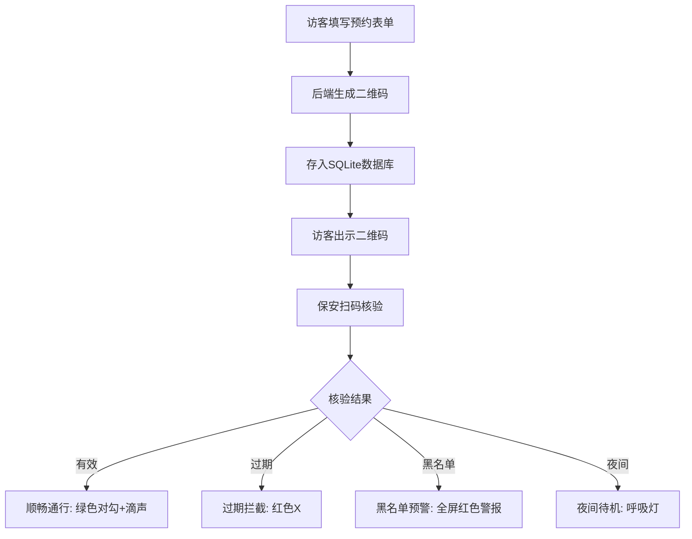

## 1. 产品概述
写字楼访客预约与核验系统，提供访客在线预约和保安现场核验功能，提升写字楼安保管理效率。
- 主要目的：简化访客预约流程，提高核验效率，保障写字楼安全
- 目标用户：访客和写字楼保安人员

## 2. 核心功能

### 2.1 用户角色
| 角色 | 使用场景 | 核心权限 |
|------|----------|----------|
| 访客 | 通过H5页面预约访问 | 填写预约信息、生成二维码 |
| 保安 | 在核验台扫码核验 | 扫码验证、查看预约状态 |

### 2.2 功能模块
1. **预约表单页面**：访客填写信息提交预约
2. **保安核验台**：保安扫码验证访客身份

### 2.3 页面详情
| 页面名称 | 模块名称 | 功能描述 |
|-----------|-------------|---------------------|
| 预约表单 | 表单模块 | 访客姓名、手机号、访问公司、访问时间、有效期选择 |
| 预约表单 | 二维码生成 | 提交后生成带时间戳的预约二维码 |
| 保安核验台 | 扫码模块 | 扫描访客二维码 |
| 保安核验台 | 状态显示 | 显示通行状态（顺畅通行/过期拦截/黑名单预警/夜间待机） |
| 保安核验台 | 音效播放 | 核验成功时播放"滴"声 |
| 保安核验台 | 动画效果 | 不同状态对应的视觉动画 |

## 3. 核心流程
访客通过H5页面填写预约信息 → 后端接收并生成带时间戳的二维码字符串存入SQLite → 访客到达现场出示二维码 → 保安使用核验台扫码 → 后端验证当前时间与有效期 → 根据核验结果返回不同状态 → 核验台显示对应状态并播放音效

## 4. 用户界面设计
### 4.1 设计风格
- **预约表单**：极简风格，浅色背景，圆角卡片，清晰的表单布局
- **保安核验台**：深色模式，高对比度，大字号，醒目状态指示
- **主色调**：
  - 预约表单：蓝色 #3b82f6
  - 核验台正常：绿色 #22c55e
  - 核验台错误：红色 #ef4444
  - 核验台背景：深灰 #0f172a
- **按钮样式**：圆角矩形，hover效果，点击反馈
- **字体**：使用系统无衬线字体，标题大号加粗，正文适中
- **布局风格**：居中卡片式布局
- **动画**：状态切换时的平滑过渡动画

### 4.2 页面设计概述
| 页面名称 | 模块名称 | UI元素 |
|-----------|-------------|-------------|
| 预约表单 | 表单模块 | 白色卡片，蓝色边框，表单标签和输入框垂直排列 |
| 预约表单 | 二维码展示 | 居中的二维码图片，下方显示预约信息 |
| 保安核验台 | 主界面 | 深色背景，顶部状态指示器，中间扫码区域，底部信息栏 |
| 保安核验台 | 顺畅通行 | 全屏绿色，生长动画的对勾图标，清脆滴声 |
| 保安核验台 | 过期拦截 | 全屏红色，爆出动画的X图标，悬浮过期信息 |
| 保安核验台 | 黑名单预警 | 全屏红色闪烁，警报弹窗，大字警示 |
| 保安核验台 | 夜间待机 | 暗化屏幕，中央微弱呼吸灯 |

### 4.3 响应性
- 预约表单：移动端优先设计，适配各种手机屏幕
- 保安核验台：适配平板和桌面端，大尺寸触控优化

### 4.4 音效设计
- 顺畅通行：清脆的"滴"声（800Hz，0.2秒）
- 黑名单预警：警报声（400-800Hz循环，1秒）

